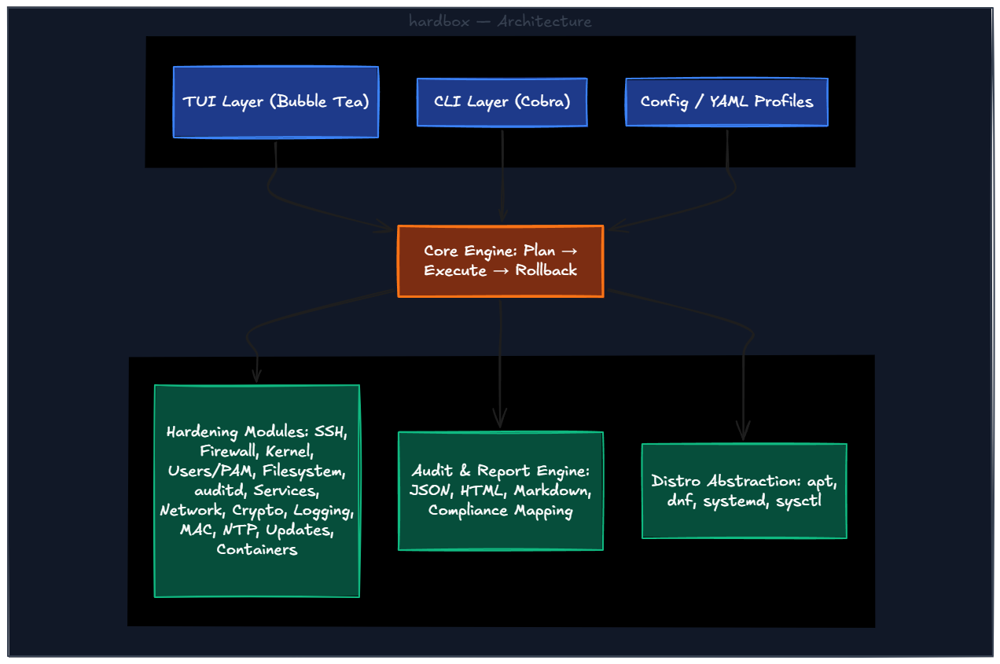

<div align="center">

**The definitive Linux hardening toolkit for IT, Cloud, Infrastructure, and Security teams.**

[](https://github.com/jackby03/hardbox/releases)
[](LICENSE)
[](go.mod)
[](docs/COMPLIANCE.md)
[](https://github.com/jackby03/hardbox/actions)
[]()
[](CONTRIBUTING.md)
[](CODE_OF_CONDUCT.md)
[](https://acs.jackby03.com)


</div>

---

## What is hardbox?

**hardbox** is an open-source, TUI-driven Linux server hardening toolkit designed for modern infrastructure teams. It transforms the complex, error-prone process of securing Linux servers into a **guided, auditable, and repeatable workflow** — whether you're locking down a cloud VM, a bare-metal server, a Kubernetes node, or a developer workstation.

It covers every layer of the security stack: kernel parameters, SSH, firewall, PAM, filesystem permissions, audit logging, cryptography, service hardening, and full compliance mapping against industry frameworks (CIS, NIST, STIG, PCI-DSS, ISO 27001).

---

## Why hardbox?

| Pain Point | hardbox Solution |
|:---|:---|
| Hardening is manual, slow, and inconsistent | Automated modules with dry-run and rollback |
| Scripts break across distros | Distro-aware engine with a unified API |
| No visibility into what was changed | Full audit trail + structured HTML/JSON reports |
| Compliance frameworks are overwhelming | Built-in profiles: CIS L1, production, dev (more on roadmap) |
| Requires deep security expertise | Modern TUI — zero expertise needed to start |
| Cloud environments have unique requirements | Cloud-native profiles for AWS, GCP, Azure (roadmap) |

---

## Key Features

| Feature | Description |
|:---|:---|
| **Modern TUI** | Interactive terminal UI (Bubble Tea). Navigate, configure, and apply hardening without memorizing commands |
| **Modular Architecture** | Enable or disable any module independently. Mix and match profiles at will |
| **12 Built-in Profiles** | `cis-level1`, `cis-level2`, `pci-dss`, `stig`, `hipaa`, `nist-800-53`, `iso27001`, `cloud-aws`, `cloud-gcp`, `cloud-azure`, `production`, `development` |
| **Dry Run Mode** | Preview every exact change before it's applied. Safe to run on live servers |
| **One-command Rollback** | Every change is snapshotted. Revert any module or an entire session instantly |
| **Audit Reports** | JSON, HTML, and Markdown output — machine-readable and CI/CD-friendly |
| **Audit Diff** | `hardbox diff` — compare two audit reports, detect regressions, gate CI/CD with exit code 1 |
| **Fleet Management** | `hardbox fleet` — concurrent remote multi-host hardening via SSH with unified HTML report |
| **Web Dashboard** | `hardbox serve` — local read-only HTTP dashboard for browsing and comparing reports |
| **Plugin SDK** | Custom hardening modules via Go plugin interface — no fork or recompile required |
| **Compliance Mapping** | 100+ checks mapped to CIS, NIST 800-53, STIG, PCI-DSS, HIPAA, and ISO 27001 |
| **Headless / CI Mode** | Unattended runs via config file — Ansible, Terraform, cloud-init, GitHub Actions |
| **Distro-aware** | Ubuntu, Debian, RHEL, Rocky Linux, AlmaLinux, Amazon Linux, Fedora |

---

## Quick Start

### Install

```bash
# One-command install (auto-detects linux/amd64 or linux/arm64)
curl -fsSL https://hardbox.jackby03.com/install.sh | bash

# Install a specific release or pre-release
curl -fsSL https://hardbox.jackby03.com/install.sh | HARDBOX_VERSION=v0.1.0 bash

# Verify installation
hardbox --version
```

> **go install** (requires Go 1.22+)
> ```bash
> go install github.com/hardbox-io/hardbox/cmd/hardbox@latest
> ```
>
> Or grab any release tarball from **[github.com/jackby03/hardbox/releases](https://github.com/jackby03/hardbox/releases)**.

### Usage

```bash
# Launch the interactive TUI
sudo hardbox

# Audit your system — no changes made
sudo hardbox audit --profile cis-level1 --format html --output ~/audit.html

# Preview all changes before applying (dry run)
sudo hardbox apply --profile production --dry-run

# Apply hardening and generate a report
sudo hardbox apply --profile production --report ./hardbox-$(date +%Y%m%d).html

# Headless / CI-CD mode
sudo hardbox apply --config /etc/hardbox/config.yaml --non-interactive

# Rollback the last session
sudo hardbox rollback apply --last

# Compare two audit reports and fail on regressions
hardbox diff audit-before.json audit-after.json --format html --output diff.html

# Harden a fleet of hosts concurrently via SSH
hardbox fleet apply --hosts hosts.txt --profile production --concurrency 10

# Browse audit reports in a local web dashboard
hardbox serve --reports-dir ./reports
```

---

<!--
## Preview

> Screenshot coming soon.

---
-->

## Hardening Modules

| Module | Description | Controls Covered |
|---|---|---|
| **SSH** | SSH daemon configuration, key management, port hardening | CIS 5.2, STIG SSH |
| **Firewall** | UFW / nftables / firewalld — allowlist-based rules | CIS 3.5, NIST SC-7 |
| **Kernel** | sysctl network, memory, and filesystem protections | CIS 3.1–3.3, STIG |
| **Users & PAM** | Password policy, account lockout, sudo, privilege review | CIS 5.3–5.6, PCI 8 |
| **Filesystem** | Partition options, /tmp, SUID/SGID audit, world-writable | CIS 1.1, NIST SC-28 |
| **Audit Logging** | auditd rules covering all STIG/CIS required audit events | CIS 4.1, NIST AU-12 |
| **Services** | Disable unnecessary services, inetd, xinetd, avahi, cups | CIS 2.1–2.2 |
| **Network** | IPv6, uncommon protocols, broadcast, redirects, spoofing | CIS 3.1–3.4 |
| **Cryptography** | TLS versions, cipher suites, FIPS mode, entropy | NIST SC-17 |
| **Logging** | rsyslog / journald — remote logging, log integrity, rotation | CIS 4.2, NIST AU |
| **AppArmor/SELinux** | Mandatory Access Control policy enforcement | CIS 1.6, STIG |
| **Time (NTP/chrony)** | Time synchronization and integrity for audit trails | CIS 2.2.1, PCI 10.6 |
| **Updates** | Unattended upgrades, security repos, version pinning | CIS 1.9, NIST SI-2 |
| **Containers** | Docker/Podman daemon hardening, seccomp, namespace isolation | CIS Docker Benchmark |
| **Mount & Partitions** | Dedicated partitions for `/tmp`, `/var`, `/home`; kernel module blacklisting | CIS 1.1, STIG V-238149 |

---

## Compliance Profiles

### Available now

<div align="center">

| Profile | Framework | Best For |
|:---:|:---|:---|
| `cis-level1` | CIS Benchmarks Level 1 | Minimum baseline — low disruption |
| `cis-level2` | CIS Benchmarks Level 2 | High-security — sensitive data and compliance |
| `pci-dss` | PCI-DSS v4.0 | Cardholder data environments (CDE) |
| `stig` | DISA STIG (Ubuntu 22.04 V1R1) | DoD and high-assurance systems |
| `hipaa` | HIPAA Security Rule (45 CFR Part 164) | Healthcare — ePHI environments |
| `nist-800-53` | NIST SP 800-53 Rev. 5 High | Federal / high-assurance environments |
| `iso27001` | ISO/IEC 27001:2022 | ISMS-certified and compliant organisations |
| `cloud-aws` | CIS AWS Foundations Benchmark v2.0 | AWS EC2 instances |
| `cloud-gcp` | CIS GCP Foundations Benchmark v2.0 | GCP Compute Engine VMs |
| `cloud-azure` | CIS Azure Foundations Benchmark v2.1 | Azure Virtual Machines |
| `production` | hardbox curated | Cloud production servers |
| `development` | hardbox curated | Dev/staging — security + developer usability |

</div>


---

## Supported Platforms

<div align="center">

| Distribution | Versions | Cloud |
|:---:|:---:|:---|
| Ubuntu | 20.04 · 22.04 · 24.04 LTS | AWS · GCP · Azure · DigitalOcean |
| Debian | 11 · 12 | ✓ |
| RHEL / CentOS Stream | 8 · 9 | ✓ |
| Rocky Linux | 8 · 9 | ✓ |
| AlmaLinux | 8 · 9 | ✓ |
| Amazon Linux | 2 · 2023 | AWS |
| Fedora | 39 · 40 | ✓ |

</div>

---

## Architecture

<div align="center">
  
</div>

---

## Operations

- Contributor workflow and development setup: [CONTRIBUTING.md](CONTRIBUTING.md)
- DevSecOps, branch protection, and release automation: [docs/DEVSECOPS.md](docs/DEVSECOPS.md)

---

## Roadmap

### v0.1 — Foundation ✅ _pre-release_
- [x] Core engine with dry-run and rollback
- [x] 13 hardening modules — SSH, Firewall, Kernel, Users/PAM, Auditd, Filesystem, Services, Logging, Network, NTP, MAC, Containers
- [x] `cis-level1`, `production`, `development` profiles
- [x] Interactive TUI dashboard
- [x] Reports: JSON, HTML, Text, Markdown
- [x] `--log-level`, `--dry-run`, `--non-interactive` flags
- [x] `install.sh` one-liner installer
- [x] Midnight Shield landing page — [hardbox.jackby03.com](https://hardbox.jackby03.com)

### v0.2 — Coverage ✅
- [x] `cis-level2` profile
- [x] `pci-dss` profile
- [x] `stig` profile
- [x] Filesystem — `/var/tmp` mount hardening check (fs-008, CIS 1.1.8–1.1.10)
- [x] Full RHEL / Rocky Linux parity

### v0.3 — Ecosystem ✅
- [x] `hipaa` profile
- [x] `iso27001` profile
- [x] `cloud-aws`, `cloud-gcp`, `cloud-azure` profiles
- [x] `nist-800-53` profile
- [x] Ansible role integration
- [x] Terraform provisioner
- [x] cloud-init support

### v0.4 — Architecture & Scale ✅
- [x] CLI refactor — extract commands to `internal/cli/` package ([#120](https://github.com/jackby03/hardbox/issues/120))
- [x] `hardbox fleet` — remote multi-host hardening via SSH ([#121](https://github.com/jackby03/hardbox/issues/121))
- [x] Mount & partition hardening module (15th module) ([#122](https://github.com/jackby03/hardbox/issues/122))
- [x] Plugin SDK — custom hardening module interface ([#123](https://github.com/jackby03/hardbox/issues/123))
- [x] `hardbox diff` — audit comparison reports ([#124](https://github.com/jackby03/hardbox/issues/124))
- [x] `hardbox serve` — lightweight web dashboard ([#125](https://github.com/jackby03/hardbox/issues/125))

### v0.5 — Observability & Continuous Compliance
- [ ] `hardbox watch` — daemon mode, audit on schedule, detect regressions automatically
- [ ] Webhook / alerting — Slack and HTTP webhooks on regression or critical finding
- [ ] Fleet overview in `hardbox serve` — aggregate multi-host scores, trends, regressions
- [ ] Profile inheritance — `extends: cis-level1` in YAML, override only what differs
- [ ] Trend history — compliance score over time using historical JSON reports
- [ ] SARIF export — `--format sarif` for GitHub Advanced Security and SIEM integration

### v0.6 — Deep Coverage I
- [ ] `boot` module — GRUB password, Secure Boot, `/boot` permissions
- [ ] `storage` module — LUKS/dm-crypt, encrypted swap, `/etc/crypttab`
- [ ] `integrity` module — AIDE/Tripwire install, baseline generation, cron verification
- [ ] `malware` module — rkhunter/chkrootkit, suspicious processes, `/tmp` noexec
- [ ] `shells` module — `TMOUT`, `HISTSIZE`, shell timeout, `.bashrc`/`.profile` audit
- [ ] `processes` module — process accounting, `ulimits`, `/etc/security/limits.conf`

### v0.7 — Deep Coverage II & Agent
- [ ] `hardware` module — USB lockdown (usbguard), Bluetooth/FireWire/Thunderbolt DMA
- [ ] `nameservices` module — `/etc/hosts`, `nsswitch.conf`, DNSSEC, resolver validation
- [ ] `webserver` module — Apache/nginx hardening: tokens, headers, TLS, directory listing
- [ ] `databases` module — MySQL/PostgreSQL: remote root, test DBs, anonymous users
- [ ] `hardbox agent` — lightweight telemetry agent reporting JSON to configurable URL
- [ ] Package integrity — `debsums` / `rpm -Va` binary verification

### v0.8 — SaaS Foundation
- [ ] Backend API — multi-tenant report ingest, PostgreSQL, Go service
- [ ] Auth — OAuth2/OIDC (GitHub, Google), JWT sessions
- [ ] Cloud dashboard — hosted fleet view, trends, alerts powered by agent reports
- [ ] Multi-host management — group hosts by tag, apply profiles per group

### v0.9 — Enterprise & Polish
- [ ] SSO / SAML 2.0 — Okta, Azure AD, Google Workspace
- [ ] RBAC — Admin, Analyst, Read-only roles per org and host group
- [ ] Audit log — immutable record of who applied what, when, on which host
- [ ] Billing — Starter / Pro / Business plans, Stripe integration
- [ ] Compliance PDF reports — executive reports per framework with evidence
- [ ] Custom checks — define checks via YAML without writing Go

### v1.0 — Production Ready GA
- [ ] 300+ checks across 21+ modules — full Lynis parity and beyond
- [ ] SaaS GA with active billing
- [ ] Enterprise: SSO, RBAC, audit log, SLA
- [ ] Plugin SDK v1 API frozen
- [ ] `.deb` / `.rpm` native packages via GoReleaser
- [ ] Full documentation and migration guides

---

## Contributing

hardbox is open source and community-driven. Contributions of all kinds are welcome — bug reports, new modules, profile improvements, and documentation.

```bash
git clone https://github.com/jackby03/hardbox
cd hardbox
go mod download
go build ./...
sudo go run ./cmd/hardbox
```

Please read our [Code of Conduct](CODE_OF_CONDUCT.md) before contributing.  
See [CONTRIBUTING.md](CONTRIBUTING.md) for guidelines, module development guide, and test conventions.

---

## Support the Project

If hardbox saves you time or helps keep your infrastructure secure, consider supporting its development:

<div align="center">

<a href="https://ko-fi.com/jackby03"></a>
&nbsp;
<a href="https://publishers.basicattentiontoken.org/en/c/jackby03"></a>

</div>

---

## License

[MIT License](LICENSE) — free for personal, commercial, and government use.

---

<div align="center">

**Built for the engineers who know that security is not a feature — it's a foundation.**

</div>
